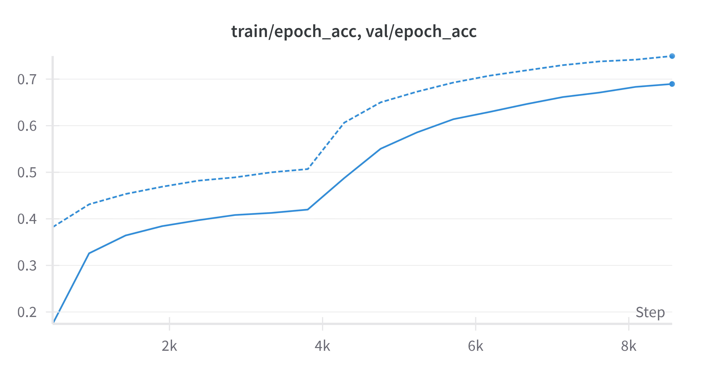
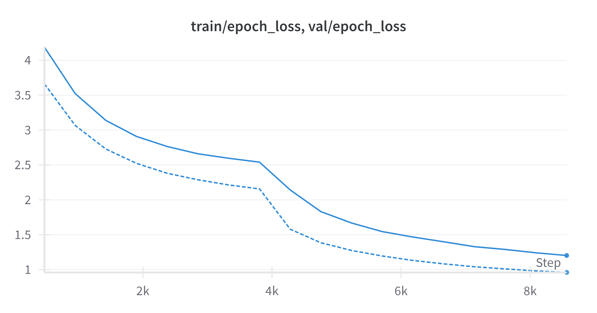

# Food101 End-to-End Image Classifier (PyTorch + SageMaker + Gradio)

**A reproducible, end-to-end PyTorch pipeline for Food101 image classification.**
Supports local development, SageMaker training, flexible dataset prep, Weights & Biases, and is ready for deployment through Gradio.
A hosted demo is available on Hugging Face Spaces: [Food101 End-to-End Classifier](https://huggingface.co/spaces/codinglabsong/food101-end2end-classifier-sagemaker-gradio).

## Features
- EfficientNet-B2 transfer learning (feature extraction + fine-tuning)
- Simple, reproducible training with local or SageMaker workflows
- Dataset preparation: full or small sample subsets
- Logging and experiment tracking (Weights & Biases)
- Model checkpointing and flexible configuration
- Ready for deployment (Gradio web app)
- Gradient clipping, OneCycle LR policy, and mixed precision training (with `autocast` and `GradScaler`) for improved stability and GPU memory efficiency
- Tests and developer tools such as ruff and black

## Pre-trained Weights
Skip training and download the latest checkpoint from the
[GitHub Releases](https://github.com/codinglabsong/food101-end2end-classifier-sagemaker-gradio/releases/latest) page.

| File | Architecture | Test Acc. | Dataset | Typical Acc.† |
|------|--------------|-----------|---------|-------------------|
| model.pth | EfficientNet-B2 (IMAGENET1K_V1) | 80.0 % | Food-101 | 78 – 82 %† |

*† Published EfficientNet-B2 runs on Food-101 usually score 78–82 % top-1.*

<details>
<summary>Training hyper-parameters</summary>

* seed = 42 &nbsp;•&nbsp; batch size = 128 &nbsp;•&nbsp; img size = 224  
* phase 1 epochs = 8 &nbsp;•&nbsp; phase 2 epochs = 10  
* lr-head = 4e-3 &nbsp;•&nbsp; lr-backbone = 5e-4 &nbsp;•&nbsp; patience = 3  
* workers = 2
</details>

**Usage:** move the file to `output/model.pth` (or update the path) before running Gradio inference.

## Project Structure
```graphql
├── assets/                    # Images for README
├── config/
│   └── prod.yaml              # Config for SageMaker
├── data/                      # Datasets (generated by scripts)
│   └── full/                  # Entire dataset
│   └── sample/                # Sample dataset for local testing
├── notebooks/
│   └── 00_explore.ipynb       # EDA, prototyping
├── scripts/
│   ├── download_full.py       # Download full Food101 as ImageFolder
│   ├── download_sample.py     # Create small per-class sample for local testing
│   └── remote_train.py        # Launch SageMaker training job
├── src/
│   └── train.py               # Main training script
├── tests/                     # Tests
├── app.py                     # Gradio app interface
├── class_names.txt            # Food101 class names for Gradio
├── .env.example               # Example for API keys/secrets
├── requirements.txt           # Pip dependencies
├── requirements-dev.txt       # Pip dependencies for developer tools
├── .pre-commit-config.yaml    # Pre-commit settings for ruff and black
├── README.md
├── LICENSE
└── .gitignore
```

## Quick Start
### 1. Clone & Install
```bash
git clone https://github.com/codinglabsong/food101-end2end-classifier-sagemaker-gradio.git
cd food101-classifier
pip install -r requirements.txt
```
*For CUDA users, see PyTorch's [install guide](https://pytorch.org/get-started/locally/)*

### 2. Prepare the Dataset
- Quick sample Food101 dataset for local development:
    ```bash
    python scripts/download_sample.py --out data/sample --train-per-class 20 --test-per-class 4
    ```
- Full Food101 dataset (may take time/disk space):
    ```bash
    python scripts/download_full.py --out data/full
    ```

### 3. Setting Environment Variables
Edit `.env` using `.env.example` as a guide for AWS and wandb keys.

### 4. Train Locally
```bash
python src/train.py \
  --batch-size 32 \
  --num-epochs-phase1 3 \
  --num-epochs-phase2 2 \
  --lr-head 1e-3 \
  --lr-backbone 1e-4 \
  --patience 3 \
  --num-workers 4 \
  --img-size 224
```
*Use `--help` for all options.*

## Results
My model (EfficientNet-B2) achieved:

| Metric              | Value |
|---------------------|------:|
| Training accuracy   | 69.0% |
| Validation accuracy | 75.0% |
| Test accuracy       | 80.0% |




The charts above show accuracy and loss over 18 epochs (8 epochs for the head, 10 for fine‑tuning). Solid lines represent training metrics, while dotted lines indicate validation metrics.

## SageMaker Training
1. Upload tarred datasets to S3:
    ```bash
    tar czf food101-train.tar.gz -C data/full/train .
    tar czf food101-test.tar.gz -C data/full/test .
    aws s3 cp food101-train.tar.gz s3://<your-bucket>/full/
    aws s3 cp food101-test.tar.gz s3://<your-bucket>/full/
    ```

2. Launch SageMaker training:
    ```bash
    python scripts/remote_train.py
    ```

## Running the Gradio Inference App
This project includes an interactive Gradio app for making predictions with the trained model.

1. **Obtain the Trained Model:**
- Make sure you have the trained model file (`model.pth`). 
- If you trained the model yourself, it should be saved automatically to the `output/` directory.
- If you received a pre-trained model, download it and place it in the `output/` directory at the project root.

2. **Run the App Locally:**
    ```bash
    python app.py
    ```
- The app will start locally and print a link (e.g., `http://127.0.0.1:7860`) to access the web UI in your browser.

## Deploying on Hugging Face Spaces
1. Create a new Gradio Space on [Hugging Face](https://huggingface.co/spaces).
2. Upload the following files from this repo:
   - `gradio_app.py`
   - `requirements.txt`
   - `class_names.txt`
   - `config/prod.yaml`
   - `output/model.pth`
   - *(optional)* an `examples/` folder with sample images for the Gradio UI
3. Commit and push to the Space. Hugging Face will build and launch the app.
4. View the hosted demo: [Food101 End-to-End Classifier](https://huggingface.co/spaces/codinglabsong/food101-end2end-classifier-sagemaker-gradio)

## Preprocessing Consistency & Image Size Limit

> **Important:**  
> The preprocessing pipeline (image resizing, cropping, normalization) **must be identical** between training and inference (including Gradio app or deployment).
>
> - All transforms should use parameters from `config/prod.yaml` (or your config file).
> - The value of `img_size` used for training and inference must always be ≤ 256, since images are first resized so their short edge is 256 before center cropping.  
> - **Do not set `img_size` greater than 256.** This would result in errors or ineffective cropping during inference.

**Best practice:**  
Update only your config file (not hardcoded values) when changing image size or normalization, and always reload configs in both training and inference code.

## Requirements
- See `requirements.txt`
- Python >= 3.9
- PyTorch >= 2.6

## Development
Install the developer tools and set up `pre-commit` hooks:

```bash
pip install -r requirements-dev.txt
pre-commit install
```

Run formatting, linting, and tests with:

```bash
pre-commit run --all-files
pytest
```

## Contributing
Open to issues and pull requests!

## References
- [Food-101 Dataset](https://www.vision.ee.ethz.ch/datasets_extra/food-101/)
- [EfficientNet Paper](https://arxiv.org/abs/1905.11946)
- [PyTorch Docs](https://pytorch.org/)

## License
This project is licensed under the MIT License.

## Tips:
- .env.example helps keep secrets out of git.
- .gitignore: Don't track datasets, outputs, wandb, or .env.